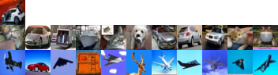

# deep-INFOMAX
Chainer implementation of [Learning deep representations by mutual information estimation and maximization.](https://arxiv.org/abs/1808.06670)

# Example of clustering result on CIFAR10

Car class image was taken from the CIFAR10 test set, then the L1 distance in encoder feature space was calculated for the remaining test images. The top row shows the test image, middle row shows the 10 closest images in terms of L1 distance, and the bottom row shows the 10 furthest images.

# Usage
To train, run:

`$ python train.py -g 0 -o output_directory --alpha X --beta Y --gamma Z`, replacing XYZ with the hyperparameters you want (see paper for more details). Training for 1000 epochs takes roughly 24 hours.

To perform some simple clustering, run:

`$ python cluster.py -g 0 -i output_directory/encoder_epoch_1000`. This will output an image similar to the one above.
